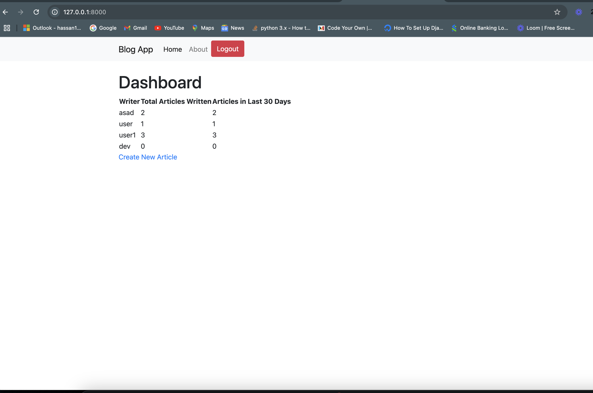
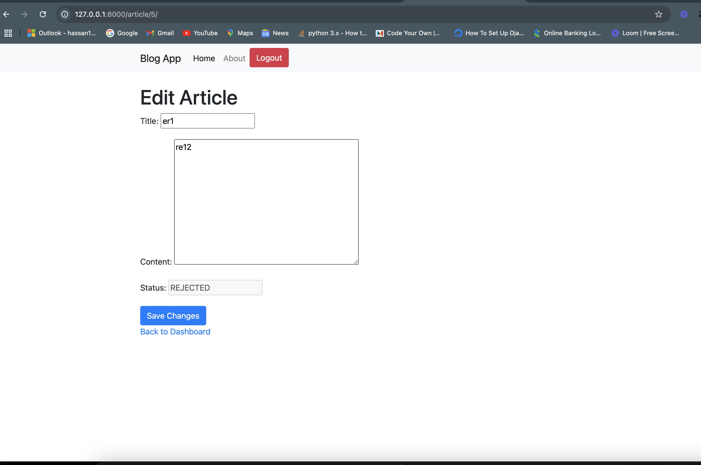
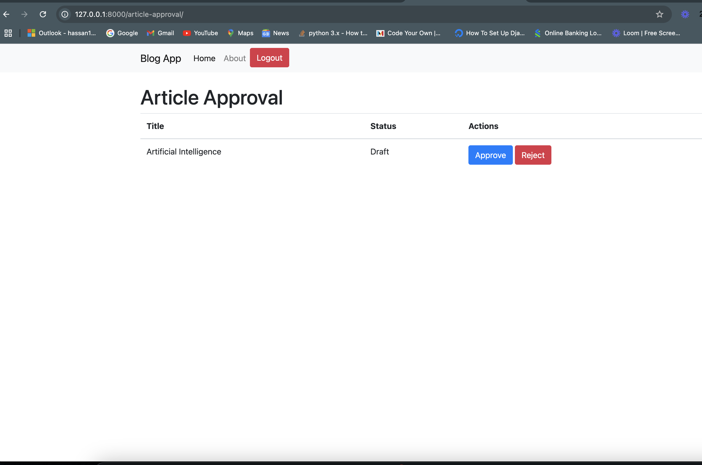
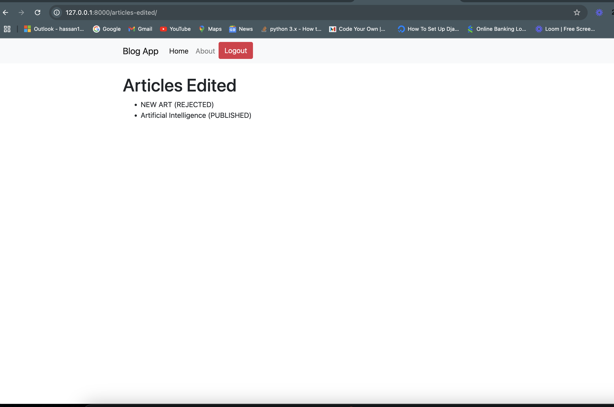

# Project Name

A brief description of your project. Explain its purpose and functionality.

## Table of Contents

- [Features](#features)
- [Requirements](#requirements)
- [Installation](#installation)
- [Usage](#usage)
- [Screenshots](#screenshots)
- [Running Tests](#running-tests)
- [Docker Build](#docker)
- [Contributing](#contributing)
- [License](#license)
- [Contact](#contact)

## Features

- Blog Application to help a team of writers and editors manage the content they’re creating

## Requirements

- Python 3.12.7
- Django 5.1.2

## Installation

Follow these steps to set up the project locally:

1. **Clone the repository:**

   ```bash
   git clone https://github.com/your-username/your-repository.git
   cd your-repository 
2. **Create a virtual environment:**
    python3 -m venv venv
    source venv/bin/activate
3. **Install dependencies**
    pip install -r requirements.txt
4. **Set up the databases**
    python manage.py migrate
5. **Create a superuser (optional, for admin access)**
    python manage.py createsuperuser
5. **CRun the development server**
    python manage.py runserver


## Usage

- Article Creation 
- Writer Article Detail Page (located at "/article/<article_id>/")
- Article Approval Page  (located at "/article-approval")
- Articles Edited Page (located at "/articles-edited")


## Screenshots

### Dashboard



### Article Detail/Edit Page



### Article Approval Page



### Article Edited Page




## Running Tests

To ensure your application works correctly, you can run the automated tests included in the project. Follow these steps:

1. **Set Up Your Environment**: Make sure you have the required dependencies installed and your virtual environment activated.

2. **Run All Tests**: 
   To run all tests in your project, execute the following command in your terminal:

   ```bash
    python manage.py test blogapp.tests.BlogAppTests


## Docker Build

- make build: builds and starts the docker container
- make up: starts the docker container
- make ssh: SSH into the blogapp container
- make server: executes the django python manage.py runserver command inside the running blogapp container
- make down: stops the docker container
- make flake8: runs flake8 linting on the app
- make test: runs your python tests
